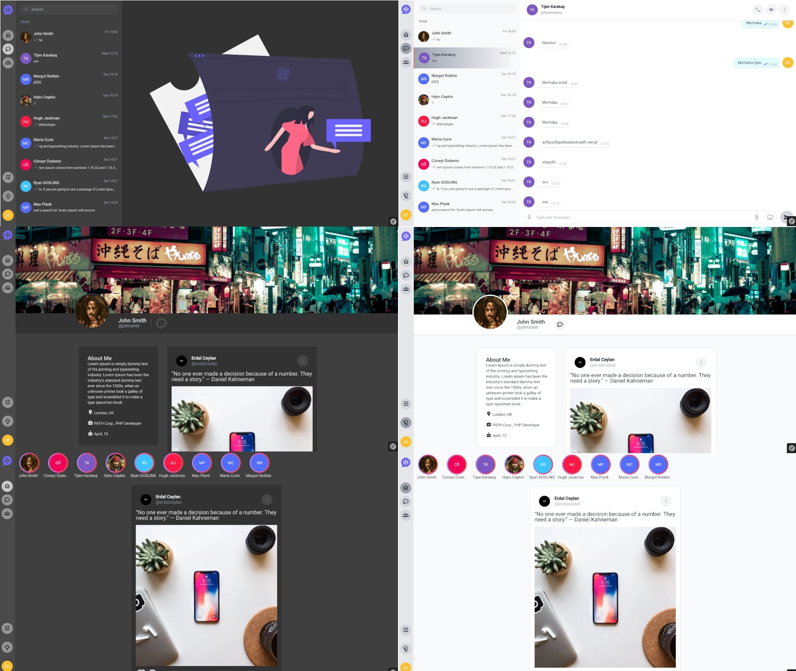

## PHP Social Media and Chat APP - endpoint

#### symfony 6.4 LTS and PHP 8.1 >= your version

### Run with Docker

create docker network 
```sh
docker network create --driver bridge blize-network
```

run for up project
```sh
docker-compose up -d
```

connect php container
```sh
ddocker exec -ti blize-php bash
```

create tabes
```sh
bin/console d:s:u --dump-sql
//OR
bin/console doctrine:schema:update --force
```

fill dummy users
```sh
bin/console fill:fill_users
```

fill dummy messages
```sh
bin/console fill:mongo-messages
```

fill dummy stories
```sh
bin/console fill:mongo-stories
```


Blize Social Media  Websocket [https://github.com/erdalceylan/blize-socket](https://github.com/erdalceylan/blize-socket)

Blize Social Media Angular frontend [https://github.com/erdalceylan/blize-angular](https://github.com/erdalceylan/blize-angular)



